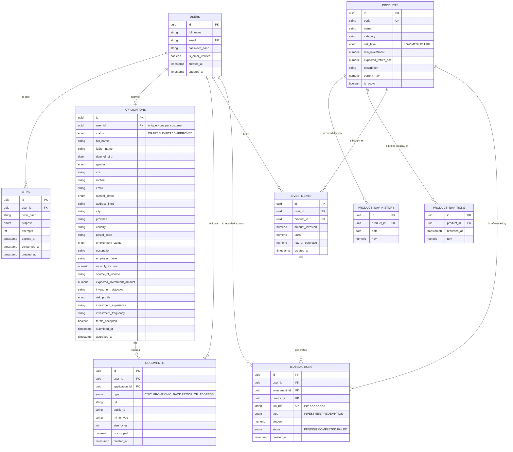

# Investment / Account Opening Portal

A full-stack investment account opening portal: customers sign up with email OTP
verification, complete a KYC account opening application with document upload,
get approved, and then invest in funds and track a portfolio that revalues as
fund prices move.

## Tech Stack

| Layer | Technology |
| --- | --- |
| Frontend | React 19, Vite, React Router, React Hook Form, Tailwind CSS v4, Recharts |
| Backend | Node.js, Express |
| Database | PostgreSQL with Prisma ORM |
| Auth | JWT access tokens, bcrypt password hashing |
| Validation | Zod (shared between client and server) |
| Email | Resend |
| File storage | Cloudinary, with a local-disk fallback for development |
| API docs | Swagger UI (OpenAPI 3) |

## Architecture

```
client/                 React single-page application
server/
  prisma/               Schema, migrations and seed data
  scripts/              End-to-end smoke tests and operational scripts
  src/
    config/             Environment validation and the Prisma client
    routes/             Route definitions
    controllers/        Request/response handling only
    services/           Business logic
    jobs/               Scheduled work (the fund price simulation)
    storage/            Document storage adapters (Cloudinary / local disk)
    middlewares/        Auth, validation, uploads, rate limiting, errors
    validators/         Zod request schemas
    utils/              Error types, response envelope, money, serializers
    docs/               OpenAPI specification
```

Controllers stay thin and delegate to services, so business logic is testable
and reusable independently of Express.

### Response format

Every endpoint returns the same envelope:

```jsonc
// success
{ "success": true, "message": "Signed in successfully.", "data": { } }

// failure
{ "success": false, "message": "Incorrect email or password.", "code": "INVALID_CREDENTIALS" }
```

The `code` field is a stable machine-readable identifier the frontend branches
on, so user-facing copy can change without breaking client logic.

## Database

Nine entities model the full journey from signup to portfolio.



### Design decisions

**Money is stored as `NUMERIC`, never a floating point type.** Floating point
rounding produces incorrect balances, which is unacceptable in a financial
application.

**Investments store units and the NAV at purchase**, not a stored current value:

```
units         = amount_invested / nav_at_purchase
current_value = units x product.current_nav
```

This makes portfolio valuation a real calculation that moves with the fund
price, rather than a figure that has to be manually kept in sync. Valuation
rounds per fund everywhere it happens, so the end of the performance chart
always lands exactly on the figure shown on the dashboard.

**An investment and its transaction are written in a single database
transaction**, so a half-recorded investment can never exist.

**`documents` is unique on `(application_id, type)`**, so re-uploading a CNIC
front replaces the existing one instead of accumulating orphaned files.

**`applications` is unique on `user_id`** — a customer has exactly one account
opening application, which is created as a draft and progresses through
`SUBMITTED` to `APPROVED`.

**Daily and intraday prices are separate tables.** A real fund publishes one
official NAV per day, which is what long-range performance and portfolio
valuation are measured against; intraday prices are a live feed that only
exists to show movement during the day. Keeping them apart means
`product_nav_history` stays one clean row per day, while `product_nav_ticks`
can be pruned to a rolling 48-hour window without touching history.

**Fund prices are simulated, and that is stated rather than hidden.** There is
no market behind this application, so the server publishes a new price for each
fund every five minutes: a random walk between 100 and 130 whose step size is
scaled by the fund's risk level. The direction of each move is biased by how
close the price is to an edge rather than clamped at the boundary, which keeps
the walk inside the band without it sticking to a bound for days. Set
`NAV_SIMULATION=false` to freeze prices, which is where a real feed would be
wired in.

## Features

**Account opening.** A multi-step KYC application is saved as a draft as the
customer goes, then submitted for approval. Uploaded documents are verified by
their magic bytes, not just the declared MIME type, so a text file renamed to
`.png` is rejected. Investing is gated behind an approved application.

**Investing and portfolio.** Customers invest in a fund, receive units at the
current NAV, and see a portfolio that revalues as prices move — with the amount
invested plotted behind the portfolio value, so the gap between the two lines is
the actual return.

**Live prices in the interface.** Screens showing prices refresh on their own,
skip hidden tabs, and flash green or red when a figure changes. A fund's detail
page can be viewed as today's tick-by-tick chart or as the 90-day daily record.

**Portfolio performance adapts to how long you have been invested.** A daily
series is right for a portfolio measured in weeks, but somebody who invested an
hour ago has exactly one day to plot, which draws as a single dot. Inside the
window where intraday prices are still kept, the same portfolio is valued at
every published tick instead.

**Risk analysis.** Each fund's risk level is weighted by what that holding is
worth today to produce a score from 1 to 3, which is then compared against the
risk profile the customer declared during account opening. A customer who chose
a medium appetite and then put most of their money into the equity fund is
flagged as carrying more risk than they signed up for.

## API

Interactive documentation is served at **`/api-docs`** when the server is
running. Every endpoint except registration, verification and login requires a
bearer token.

### Authentication

| Method | Endpoint | Description |
| --- | --- | --- |
| `POST` | `/api/auth/register` | Create an account and send a verification code |
| `POST` | `/api/auth/verify-otp` | Verify the emailed code and sign in |
| `POST` | `/api/auth/resend-otp` | Send a new verification code |
| `POST` | `/api/auth/login` | Sign in |
| `GET` | `/api/auth/me` | Get the signed-in customer |

### Account opening

| Method | Endpoint | Description |
| --- | --- | --- |
| `GET` | `/api/account/application` | Read the application, draft or submitted |
| `PUT` | `/api/account/application` | Save one or more sections of the draft |
| `GET` | `/api/account/status` | Application status and whether investing is unlocked |
| `POST` | `/api/account/documents` | Upload a CNIC or proof of address |
| `DELETE` | `/api/account/documents/:id` | Remove an uploaded document |
| `POST` | `/api/account/submit` | Submit the completed application |

### Products

| Method | Endpoint | Description |
| --- | --- | --- |
| `GET` | `/api/products` | List the funds, lowest risk first |
| `GET` | `/api/products/:id` | One fund with its daily history and intraday feed |

### Investing and portfolio

| Method | Endpoint | Description |
| --- | --- | --- |
| `POST` | `/api/investments` | Invest in a fund (requires an approved account) |
| `GET` | `/api/investments` | The customer's holdings |
| `GET` | `/api/transactions` | Paginated transaction history |
| `GET` | `/api/portfolio/summary` | Totals, gain and per-fund holdings |
| `GET` | `/api/portfolio/performance` | Value against cost over time |
| `GET` | `/api/portfolio/risk` | Risk score against the declared profile |

## Running Locally

### Prerequisites

- Node.js 20 or later
- A PostgreSQL database (local, Docker, or a hosted one such as Neon)

### Backend

```bash
cd server
npm install
cp .env.example .env     # then fill in the values below
npx prisma migrate dev
npm run db:seed
npm run dev
```

The API starts on `http://localhost:5000`, with documentation at `/api-docs`.

`npm run db:seed` loads three funds with 90 days of price history and a day of
intraday prices, plus an approved demo customer holding three funds, so the
charts have real data to draw from the moment the app opens.

### Frontend

In a second terminal:

```bash
cd client
npm install
cp .env.example .env
npm run dev
```

The app starts on `http://localhost:5174`.

### Environment variables

**Backend** (`server/.env`)

| Variable | Description |
| --- | --- |
| `NODE_ENV` | `development` or `production` |
| `PORT` | Port the API listens on (default `5000`) |
| `CLIENT_URL` | Frontend origin, used for the CORS allowlist |
| `PUBLIC_URL` | Absolute URL of this API, used to build links to locally stored uploads |
| `DATABASE_URL` | PostgreSQL connection string (pooled) |
| `DIRECT_URL` | Non-pooled connection, used by Prisma for migrations only. Optional; falls back to `DATABASE_URL` |
| `JWT_SECRET` | Signing secret, at least 32 characters |
| `JWT_EXPIRES_IN` | Token lifetime (default `7d`) |
| `BCRYPT_SALT_ROUNDS` | Password hashing cost (default `10`) |
| `OTP_LENGTH` | Digits in the verification code (default `6`) |
| `OTP_EXPIRY_MINUTES` | Code lifetime (default `10`) |
| `OTP_MAX_ATTEMPTS` | Wrong attempts before a code is locked (default `5`) |
| `OTP_RESEND_COOLDOWN_SECONDS` | Minimum gap between resends (default `60`) |
| `RESEND_API_KEY` | Resend API key. Leave empty to log codes to the console instead of sending email |
| `EMAIL_FROM` | Sender address |
| `EXPOSE_DEV_OTP` | When `true`, returns the code in the API response. Force-disabled in production |
| `CLOUDINARY_CLOUD_NAME` | Leave the Cloudinary values empty in development and uploads go to `server/uploads` instead |
| `CLOUDINARY_API_KEY` | |
| `CLOUDINARY_API_SECRET` | |
| `CLOUDINARY_FOLDER` | Upload folder (default `investment-portal`) |
| `MAX_UPLOAD_BYTES` | Largest accepted document (default 5 MB) |
| `INVESTABLE_CREDIT` | Notional balance credited on approval (default `1000000`). Real funding is out of scope |
| `NAV_SIMULATION` | Publish simulated fund prices (default `true`) |
| `NAV_SIMULATION_INTERVAL_MINUTES` | How often a new price is published (default `5`) |

**Frontend** (`client/.env`)

| Variable | Description |
| --- | --- |
| `VITE_API_URL` | Base URL of the backend API, with no trailing slash |

Generate a JWT secret with:

```bash
node -e "console.log(require('crypto').randomBytes(48).toString('hex'))"
```

### Testing the auth flow without an inbox

With `RESEND_API_KEY` unset, verification codes are printed to the server
console and returned as `data.verification.devOtp`, so the full signup flow can
be exercised without configuring email.

### Moving prices on demand

The server publishes a new price every five minutes on its own. To move prices
immediately — for a demo, or to check that the portfolio screens react:

```bash
cd server
npm run nav:advance -- --force
```

## Tests

88 end-to-end checks run against a running server. Seed the database first, so
the suite has the demo account and price history it expects.

```bash
cd server
npm run db:seed
npm test
```

| Command | Covers |
| --- | --- |
| `npm run test:auth` | 18 checks — the signup flow, validation and credential errors, token handling, the resend cooldown and the attempt lockout |
| `npm run test:products` | 27 checks — listing and ordering, the daily price series, performance figures, and the intraday feed |
| `npm run test:account` | 43 checks — draft saving and validation, submission guards, document upload rejections, portfolio valuation, risk analysis, investing limits, and cross-customer isolation |

The suite invests on the demo account as it runs, so re-run `npm run db:seed` to
reset it.

## Security

- Passwords are hashed with bcrypt and never returned by any endpoint.
- One-time codes are stored hashed, expire, and lock out after repeated wrong
  attempts.
- Authentication is enforced server side; the token carries only a user id and
  the user is re-read from the database on every request.
- An unknown email and a wrong password return identical responses, so the login
  endpoint cannot be used to enumerate registered addresses.
- Uploads are checked against their magic bytes, not the declared content type,
  and capped by size.
- Every customer-scoped query is filtered by the authenticated user id, so one
  customer cannot read another's holdings or transactions.
- All input is validated on the backend with Zod.
- Secrets are read from environment variables and are not committed.

## Deployment

The application is deployable as two services against a hosted PostgreSQL
database such as Neon.

**Backend.** Set every variable in the table above, then run
`npm run db:deploy` to apply migrations and `npm start` to serve. Two of these
matter more than the rest in production:

- **Cloudinary must be configured.** A platform instance has an ephemeral disk,
  so locally stored uploads would be lost on the next deploy.
- **`DIRECT_URL` should be the non-pooled connection.** Schema changes need a
  real session, which a transaction pooler cannot guarantee.

`EXPOSE_DEV_OTP` is force-disabled when `NODE_ENV=production` regardless of what
it is set to.

**Frontend.** `npm run build` produces a static bundle in `client/dist`. Set
`VITE_API_URL` to the deployed API URL at build time, and set the API's
`CLIENT_URL` to the frontend origin so CORS allows it.

## Demo Credentials

Created by `npm run db:seed`, already approved and holding three funds:

```
assessment@example.com
Assessment123
```
