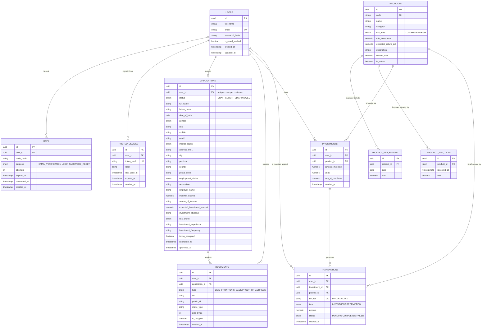

# Nivesta — Investment / Account Opening Portal

A full-stack investment account opening portal: customers sign up with email OTP
verification, complete a KYC account opening application with document upload,
get approved, and then invest in funds and track a portfolio that revalues as
fund prices move.

## Tech Stack

| Layer | Technology |
| --- | --- |
| Frontend | React 19, Vite, React Router, React Hook Form, Tailwind CSS v4, Recharts |
| Backend | Node.js, Express |
| Database | PostgreSQL with Prisma ORM |
| Auth | JWT access tokens, bcrypt password hashing |
| Validation | Zod (shared between client and server) |
| Email | SMTP via Nodemailer |
| File storage | Cloudinary, with a local-disk fallback for development |
| API docs | Swagger UI (OpenAPI 3) |

## Architecture

```
client/                 React single-page application
server/
  prisma/               Schema, migrations and seed data
  scripts/              End-to-end smoke tests and operational scripts
  src/
    config/             Environment validation and the Prisma client
    routes/             Route definitions
    controllers/        Request/response handling only
    services/           Business logic
    jobs/               Scheduled work (the fund price simulation)
    storage/            Document storage adapters (Cloudinary / local disk)
    middlewares/        Auth, validation, uploads, rate limiting, errors
    validators/         Zod request schemas
    utils/              Error types, response envelope, money, serializers
    docs/               OpenAPI specification
```

Controllers stay thin and delegate to services, so business logic is testable
and reusable independently of Express.

### Response format

Every endpoint returns the same envelope:

```jsonc
// success
{ "success": true, "message": "Signed in successfully.", "data": { } }

// failure
{ "success": false, "message": "Incorrect email or password.", "code": "INVALID_CREDENTIALS" }
```

The `code` field is a stable machine-readable identifier the frontend branches
on, so user-facing copy can change without breaking client logic.

## Database

Ten entities model the full journey from signup to portfolio.



### Design decisions

**Money is stored as `NUMERIC`, never a floating point type.** Floating point
rounding produces incorrect balances, which is unacceptable in a financial
application.

**Investments store units and the NAV at purchase**, not a stored current value:

```
units         = amount_invested / nav_at_purchase
current_value = units x product.current_nav
```

This makes portfolio valuation a real calculation that moves with the fund
price, rather than a figure that has to be manually kept in sync. Valuation
rounds per fund everywhere it happens, so the end of the performance chart
always lands exactly on the figure shown on the dashboard.

**An investment and its transaction are written in a single database
transaction**, so a half-recorded investment can never exist.

**`documents` is unique on `(application_id, type)`**, so re-uploading a CNIC
front replaces the existing one instead of accumulating orphaned files.

**`applications` is unique on `user_id`** — a customer has exactly one account
opening application, which is created as a draft and progresses through
`SUBMITTED` to `APPROVED`.

**Daily and intraday prices are separate tables.** A real fund publishes one
official NAV per day, which is what long-range performance and portfolio
valuation are measured against; intraday prices are a live feed that only
exists to show movement during the day. Keeping them apart means
`product_nav_history` stays one clean row per day, while `product_nav_ticks`
can be pruned to a rolling 48-hour window without touching history.

**Dark mode is a palette swap, not a second set of styles.** Tailwind emits
every theme colour as a CSS variable, so `bg-white` compiles to
`background-color: var(--color-white)`. Redefining those variables under a
`.dark` class flips the whole application at once. The slate ramp is inverted
rather than replaced, so each utility keeps its meaning — slate-50 is still the
page behind the cards, slate-900 still the strongest text — and every component
built against those roles keeps reading correctly. Only the handful of tokens
that carry both a fill and a text colour (`brand`, `gain`, `loss`) need a direct
override, and a panel that is dark in both themes re-scopes the light palette to
its own subtree.

**Fund prices are simulated, and that is stated rather than hidden.** There is
no market behind this application, so the server publishes a new price for each
fund every five minutes: a random walk whose band and step size both come from
the fund's risk level.

| Fund | Risk | Band | Largest move per tick |
| --- | --- | --- | --- |
| Growth Fund | High | 90 – 130 | 5.00 |
| Income Fund | Medium | 100 – 120 | 0.80 |
| Money Market Fund | Low | 100 – 108 | 0.15 |

Giving all three the same range would make them behave identically and
contradict their own descriptions — an equity fund swings several points in a
session, while a money market fund barely moves, which is the whole reason
somebody parks cash in one.

Two things shape each move.

**The edges push back**, by biasing the *direction* rather than clamping the
result. A clamp pins the price against the bound and leaves it there; a bias
lets the walk touch an edge and come straight back.

**The last move sways the next one.** Without that, every tick is close to a
coin flip — and a coin flip alternates: up, down, up, down, which is not how a
price behaves. Leaning towards whichever way it just went produces runs, so a
fund can slide for several ticks before it turns, while each individual step
stays genuinely uncertain. Every move also has a minimum size, or most ticks
land near zero and the price looks frozen between occasional jumps.

Measured over thirty simulated days, the high-risk fund covers its full band,
moves 3.10 on average and up to 5.00, holds a direction for 2.81 ticks on
average (longest run 13), and sits on a boundary for 1.60% of ticks, never more
than three in a row.

Set `NAV_SIMULATION=false` to freeze prices, which is where a real feed would be
wired in.

## Features

**Signing in takes two factors.** The password earns a single-use code by
email; the code and the password together earn the session. The password is
required before any code is sent, so the endpoint cannot be used to flood a
customer's inbox or to discover which addresses have accounts, and the password
is checked again at the second step — otherwise a code lifted from an inbox
would be enough on its own.

**A browser can be remembered for seven days**, so the code is only asked for
once per device. It skips the code and never the password — anyone who picks up
that browser still has to know it. The token is long, random, stored hashed, and
issued only on a sign-in that actually passed the code, so a stolen password
cannot mint one. Changing the password drops every remembered device, because a
reset means the account may already be in someone else's hands.

**Forgotten passwords are reset by the same machinery**, and the reset form
answers identically whether or not the address has an account. A form that says
"no such account" is a list of everybody who banks here, free to anyone who
asks.

**Account opening.** A multi-step KYC application is saved as a draft as the
customer goes, then submitted for approval. Uploaded documents are verified by
their magic bytes, not just the declared MIME type, so a text file renamed to
`.png` is rejected. Investing is gated behind an approved application.

**Investing and portfolio.** Customers invest in a fund, receive units at the
current NAV, and see a portfolio that revalues as prices move — with the amount
invested plotted behind the portfolio value, so the gap between the two lines is
the actual return.

**Live prices in the interface.** Screens showing prices refresh on their own,
skip hidden tabs, and flash green or red when a figure changes. A fund's detail
page can be viewed as today's tick-by-tick chart or as the 90-day daily record.

**Portfolio performance adapts to how long you have been invested.** A daily
series is right for a portfolio measured in weeks, but somebody who invested an
hour ago has exactly one day to plot, which draws as a single dot. Inside the
window where intraday prices are still kept, the same portfolio is valued at
every published tick instead.

**Every transaction opens its full record.** The list answers what and when;
the panel behind a row answers what the money actually bought — the units
received and the unit price paid, with the arithmetic spelled out so a customer
checking a figure does not have to work out where it came from.

**Light and dark.** The theme follows the system until the customer chooses, and
their choice then sticks. It is applied before the first paint, so there is no
white flash on load. Implemented by redefining the theme's colour variables
under one class rather than by hanging a `dark:` variant off several hundred
utilities — see **Design decisions** below.

**Risk analysis.** Each fund's risk level is weighted by what that holding is
worth today to produce a score from 1 to 3, which is then compared against the
risk profile the customer declared during account opening. A customer who chose
a medium appetite and then put most of their money into the equity fund is
flagged as carrying more risk than they signed up for.

## API

Interactive documentation is served at **`/api-docs`** when the server is
running. Every endpoint except registration, verification and login requires a
bearer token.

### Authentication

| Method | Endpoint | Description |
| --- | --- | --- |
| `POST` | `/api/auth/register` | Create an account and send a verification code |
| `POST` | `/api/auth/verify-otp` | Verify the emailed code and sign in |
| `POST` | `/api/auth/resend-otp` | Send a new verification code |
| `POST` | `/api/auth/login/request-code` | Check the password and email a sign-in code |
| `POST` | `/api/auth/login` | Sign in with the password and either that code or a remembered device |
| `POST` | `/api/auth/forgot-password` | Email a password reset code |
| `POST` | `/api/auth/reset-password` | Set a new password using that code |
| `GET` | `/api/auth/me` | Get the signed-in customer |

### Account opening

| Method | Endpoint | Description |
| --- | --- | --- |
| `GET` | `/api/account/application` | Read the application, draft or submitted |
| `PUT` | `/api/account/application` | Save one or more sections of the draft |
| `GET` | `/api/account/status` | Application status and whether investing is unlocked |
| `POST` | `/api/account/documents` | Upload a CNIC or proof of address |
| `DELETE` | `/api/account/documents/:id` | Remove an uploaded document |
| `POST` | `/api/account/submit` | Submit the completed application |

### Products

| Method | Endpoint | Description |
| --- | --- | --- |
| `GET` | `/api/products` | List the funds, lowest risk first |
| `GET` | `/api/products/:id` | One fund with its daily history and intraday feed |

### Investing and portfolio

| Method | Endpoint | Description |
| --- | --- | --- |
| `POST` | `/api/investments` | Invest in a fund (requires an approved account) |
| `GET` | `/api/investments` | The customer's holdings |
| `GET` | `/api/transactions` | Paginated transaction history |
| `GET` | `/api/portfolio/summary` | Totals, gain and per-fund holdings |
| `GET` | `/api/portfolio/performance` | Value against cost over time |
| `GET` | `/api/portfolio/risk` | Risk score against the declared profile |

### Scheduled work

| Method | Endpoint | Description |
| --- | --- | --- |
| `POST` | `/api/nav/tick` | Publish the next price for every fund |

This one is not for the browser and takes no session. It authenticates with a
shared secret instead:

```bash
curl -X POST https://your-api/api/nav/tick \
  -H "Authorization: Bearer $CRON_SECRET"
```

With `CRON_SECRET` unset the route answers 404. An unguarded way to move prices
should not come into existence because somebody forgot to set a variable, and a
403 would confirm the endpoint is there to anyone probing for it.

## Running Locally

### Prerequisites

- Node.js 20 or later
- A PostgreSQL database (local, Docker, or a hosted one such as Neon)

### Backend

```bash
cd server
npm install
cp .env.example .env     # then fill in the values below
npx prisma migrate dev
npm run db:seed
npm run dev
```

The API starts on `http://localhost:5000`, with documentation at `/api-docs`.

`npm run db:seed` loads three funds with 90 days of price history and a day of
intraday prices, plus an approved demo customer holding three funds, so the
charts have real data to draw from the moment the app opens.

### Frontend

In a second terminal:

```bash
cd client
npm install
cp .env.example .env
npm run dev
```

The app starts on `http://localhost:5174`.

### Environment variables

**Backend** (`server/.env`)

| Variable | Description |
| --- | --- |
| `NODE_ENV` | `development` or `production` |
| `PORT` | Port the API listens on (default `5000`) |
| `CLIENT_URL` | Frontend origin, used for the CORS allowlist |
| `PUBLIC_URL` | Absolute URL of this API, used to build links to locally stored uploads |
| `DATABASE_URL` | PostgreSQL connection string (pooled) |
| `DIRECT_URL` | Non-pooled connection, used by Prisma for migrations only. Optional; falls back to `DATABASE_URL` |
| `JWT_SECRET` | Signing secret, at least 32 characters |
| `JWT_EXPIRES_IN` | Token lifetime (default `7d`) |
| `BCRYPT_SALT_ROUNDS` | Password hashing cost (default `10`) |
| `OTP_LENGTH` | Digits in the verification code (default `6`) |
| `OTP_EXPIRY_MINUTES` | Code lifetime (default `10`) |
| `OTP_MAX_ATTEMPTS` | Wrong attempts before a code is locked (default `5`) |
| `OTP_RESEND_COOLDOWN_SECONDS` | Minimum gap between resends (default `60`) |
| `SMTP_HOST` | SMTP server, e.g. `smtp.gmail.com`. See **Email delivery** below |
| `SMTP_PORT` | SMTP port (default `587`; `465` switches to implicit TLS) |
| `SMTP_USER` | SMTP username, e.g. the Gmail address. Leave empty to log codes to the console |
| `SMTP_PASS` | SMTP password. For Gmail this is an App Password, not the account password |
| `EMAIL_FROM` | Optional sender. Defaults to `SMTP_USER`, the only sender Gmail accepts |
| `TRUSTED_DEVICE_DAYS` | How long "remember this device" skips the sign-in code for (default `7`) |
| `EXPOSE_DEV_OTP` | When `true`, returns the code in the API response so signup can be tested without an inbox. Force-disabled in production, and required by the auth test suite |
| `CLOUDINARY_CLOUD_NAME` | Leave the Cloudinary values empty in development and uploads go to `server/uploads` instead |
| `CLOUDINARY_API_KEY` | |
| `CLOUDINARY_API_SECRET` | |
| `CLOUDINARY_FOLDER` | Upload folder (default `investment-portal`) |
| `MAX_UPLOAD_BYTES` | Largest accepted document (default 5 MB) |
| `INVESTABLE_CREDIT` | Notional balance credited on approval (default `1000000`). Real funding is out of scope |
| `NAV_SIMULATION` | Publish simulated fund prices (default `true`) |
| `NAV_SIMULATION_INTERVAL_MINUTES` | How often a new price is published (default `5`) |
| `CRON_SECRET` | Optional, at least 16 characters. Enables `POST /api/nav/tick` so an external scheduler can publish prices. Unset, that route does not exist |

**Frontend** (`client/.env`)

| Variable | Description |
| --- | --- |
| `VITE_API_URL` | Base URL of the backend API, with no trailing slash |

Generate a JWT secret with:

```bash
node -e "console.log(require('crypto').randomBytes(48).toString('hex'))"
```

### Email delivery

Verification codes are sent over SMTP. With no credentials the code is logged
to the server console instead, so development needs no external account.

SMTP rather than a transactional email API because a shared provider sandbox
will only deliver to the address that owns the account until a domain is
verified — no use for a portal that has to email whoever signs up. An ordinary
mailbox will send to anyone.

With Gmail:

1. Turn on 2-Step Verification for the account.
2. Create an [App Password](https://myaccount.google.com/apppasswords). The
   account password will not work; Google rejects it over SMTP.
3. Set `SMTP_USER` to the address and `SMTP_PASS` to that App Password.

`EMAIL_FROM` is optional and defaults to `SMTP_USER`. Gmail replaces a sender
that does not belong to the authenticated account, so set it only to add a
display name and keep the address the same.

The active transport is logged at boot, so a misconfigured deploy is visible
immediately rather than at the first signup. A failed send never fails the
request: the API reports `emailDelivered: false` and the verification screen
says so, rather than leaving the customer waiting for an email that is not
coming.

Note that a free Gmail account is rate limited to roughly 500 messages a day.

### Testing the auth flow without an inbox

With SMTP unconfigured, verification codes are printed to the server console
and returned as `data.verification.devOtp`, so the full signup flow can be
exercised without an email account. `EXPOSE_DEV_OTP` is force-disabled when
`NODE_ENV=production`.

### Moving prices on demand

The server publishes a new price every five minutes on its own. To move prices
immediately — for a demo, or to check that the portfolio screens react:

```bash
cd server
npm run nav:advance -- --force
```

### Publishing prices from outside the server

The built-in timer covers a server that stays up. It does not survive a host
that runs the API as serverless functions, and it stops on a free instance that
sleeps when idle — which is most of the free tier. So prices can also be moved
from outside, by any scheduler that can send one HTTP request:

1. Generate a secret and set it as `CRON_SECRET` on the API.

   ```bash
   node -e "console.log(require('crypto').randomBytes(24).toString('base64url'))"
   ```

2. Point a scheduler at `POST /api/nav/tick` every five minutes, with the header
   `Authorization: Bearer <CRON_SECRET>`. [cron-job.org](https://cron-job.org),
   [UptimeRobot](https://uptimerobot.com) and a GitHub Actions `schedule:`
   workflow all do this on a free plan.

On a host that sleeps, the same request doubles as the thing that wakes it. The
secret is compared in constant time, so a caller cannot learn it a character at
a time by measuring how long the rejection takes.

## Tests

114 end-to-end checks run against a running server. Seed the database first, so
the suite has the demo account and price history it expects.

```bash
cd server
npm run db:seed
npm test
```

The signup checks need the verification code, which the API only returns when
`EXPOSE_DEV_OTP=true`. With it off, the auth suite stops at that point and says
so rather than failing five checks with errors that never name the cause; the
products and account suites are unaffected.

| Command | Covers |
| --- | --- |
| `npm run test:auth` | 39 checks — the signup flow, code expiry and delivery reporting, two-factor sign-in, password reset including its refusal to reveal who has an account, validation and credential errors, token handling, the resend cooldown and the attempt lockout |
| `npm run test:products` | 29 checks — listing and ordering, the daily price series, performance figures, the intraday feed, and the scheduler endpoint's refusal of an unauthenticated caller |
| `npm run test:account` | 46 checks — draft saving and validation, submission guards, document upload rejections, portfolio valuation, risk analysis, investing limits, and cross-customer isolation |

The suite invests on the demo account as it runs, so re-run `npm run db:seed` to
reset it.

## Security

- Passwords are hashed with bcrypt and never returned by any endpoint.
- Signing in needs a second factor: a single-use code sent to the registered
  address, checked alongside the password rather than instead of it.
- A remembered device skips only that second factor. Its token is stored hashed,
  expires on a fixed seven-day clock rather than sliding with use, and is
  revoked for every device when the password changes.
- The password reset form cannot be used to enumerate customers — every address
  gets the same answer, including when a cooldown is in force.
- One-time codes are stored hashed, expire, and lock out after repeated wrong
  attempts.
- Authentication is enforced server side; the token carries only a user id and
  the user is re-read from the database on every request.
- An unknown email and a wrong password return identical responses, so the login
  endpoint cannot be used to enumerate registered addresses.
- Uploads are checked against their magic bytes, not the declared content type,
  and capped by size.
- Every customer-scoped query is filtered by the authenticated user id, so one
  customer cannot read another's holdings or transactions.
- All input is validated on the backend with Zod.
- Secrets are read from environment variables and are not committed.

## Deployment

Two Vercel projects out of one repository — the API and the frontend — against a
hosted PostgreSQL database such as Neon.

### Backend

| Setting | Value |
| --- | --- |
| Root Directory | `server` |
| Framework Preset | Other |
| Build Command | leave empty (`vercel-build` runs `prisma generate`) |

`server/api/index.js` is the function Vercel runs, and `server/vercel.json`
rewrites every path to it, so the Express app answers exactly as it does
locally. `src/server.js` is untouched and still starts a real listening server
for local development and for hosts that run a process.

Set every variable from the table above in the project's environment, with
`NODE_ENV=production`. Four of them decide whether the deploy works:

- **`DATABASE_URL` must be the pooled connection.** Each function instance opens
  its own connections, and a serverless Postgres pooler is what keeps that from
  exhausting the database. Append `?pgbouncer=true&connection_limit=1`.
- **`DIRECT_URL` must be the non-pooled one.** Migrations need a real session,
  which a transaction pooler cannot guarantee.
- **Cloudinary must be configured.** A function has no writable disk, so
  document uploads have nowhere to land. Without it the upload endpoint refuses
  in production rather than pretending to have saved anything.
- **`CLIENT_URL` must be the frontend's own URL**, or CORS will refuse it.

Migrations do not run inside a function. Apply them from a machine that can
reach the database:

```bash
cd server
DATABASE_URL="<direct connection>" npx prisma migrate deploy
npm run db:seed          # the three funds and their price history
```

`EXPOSE_DEV_OTP` is force-disabled when `NODE_ENV=production` regardless of what
it is set to, so codes are only ever delivered by email. Configure SMTP or
nobody can sign up.

**Prices.** The in-process timer never starts in a function — there is no
process to hold it. Set `CRON_SECRET` and drive `POST /api/nav/tick` from an
external scheduler every five minutes; see **Publishing prices from outside the
server** above. Vercel's own cron runs once a day on the free plan, which is too
coarse for a feed that is meant to visibly move.

**Rate limiting** counts in the memory of one instance, so limits are per
instance rather than global. That still blunts one caller hammering one
endpoint; a shared store would be the answer if it were holding back a real
attack.

### Frontend

| Setting | Value |
| --- | --- |
| Root Directory | `client` |
| Framework Preset | Vite |
| Build Command | `npm run build` |
| Output Directory | `dist` |

Set `VITE_API_URL` to the deployed API's URL, with no trailing slash. It is read
at build time, not at run time, so changing it needs a redeploy.

`client/vercel.json` rewrites every path to `index.html`. Without it the app
404s on any URL the customer did not arrive at by clicking — a refresh on
`/portfolio`, or a bookmark.

Deploy the API first: the frontend build needs its URL, and the API needs the
frontend's. Vercel gives each project a stable `*.vercel.app` name before either
is built, so both values are known up front.

## Limitations

Stated plainly, because knowing what a thing does not do is part of knowing what
it does.

**Fund prices are simulated.** There is no market data feed. The server
publishes a new price for each fund every few minutes, and the whole simulation
sits behind one flag and one module — `NAV_SIMULATION` and
`src/services/nav.service.js` — which is where a real feed would replace it.

**Money is notional.** Approval credits a balance from `INVESTABLE_CREDIT`;
there is no payment integration, and none was asked for.

**Investments only go one way.** The schema models `REDEMPTION` transactions,
but no endpoint or screen sells a holding — only investing is implemented.

**Approval is automatic.** A submitted application is approved immediately, by
design; there is no admin portal and none was required.

**Signing in needs an inbox.** The second factor is emailed, so the seeded demo
account cannot be signed into by someone who does not receive mail at that
address. For evaluation, either set `EXPOSE_DEV_OTP=true` so the code comes back
in the API response and is shown on screen, or register with your own address —
the whole journey works from a fresh signup.

**Intraday history is a rolling window.** Tick-by-tick prices are kept for 48
hours and then pruned; anything older is served from the daily record.

**Gmail SMTP has a daily ceiling.** A free account is limited to roughly 500
messages a day, which is ample for evaluation but is not a production mail
setup.

**Tests need a running server and a seeded database.** They are end-to-end smoke
tests against real HTTP endpoints, not unit tests with mocks, so they exercise
the real stack but cannot run in isolation.

## Demo Credentials

Created by `npm run db:seed`, already approved and holding three funds:

```
assessment@example.com
Assessment123
```
