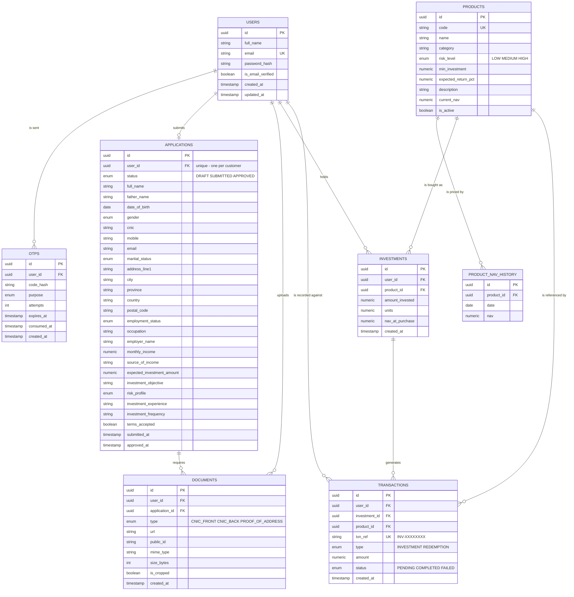

# Investment / Account Opening Portal

A full-stack investment account opening portal: customers sign up with email OTP
verification, complete a KYC account opening application with document upload,
get approved, and then invest in funds and track their portfolio.

> **Status:** in development. The authentication module is complete; the account
> opening, investment and portfolio modules are in progress.

## Tech Stack

| Layer | Technology |
| --- | --- |
| Frontend | React 18, Vite, React Router, React Hook Form, Tailwind CSS, Recharts |
| Backend | Node.js, Express |
| Database | PostgreSQL with Prisma ORM |
| Auth | JWT access tokens, bcrypt password hashing |
| Validation | Zod (shared between client and server) |
| Email | Resend |
| File storage | Cloudinary |
| API docs | Swagger UI (OpenAPI 3) |

## Architecture

```
client/                 React single-page application
server/
  prisma/               Schema, migrations and seed data
  src/
    config/             Environment validation, Prisma and Cloudinary clients
    routes/             Route definitions
    controllers/        Request/response handling only
    services/           Business logic
    middlewares/        Auth, validation, rate limiting, error handling
    validators/         Zod request schemas
    utils/              Error types, response envelope, serializers
    docs/               OpenAPI specification
```

Controllers stay thin and delegate to services, so business logic is testable
and reusable independently of Express.

### Response format

Every endpoint returns the same envelope:

```jsonc
// success
{ "success": true, "message": "Signed in successfully.", "data": { } }

// failure
{ "success": false, "message": "Incorrect email or password.", "code": "INVALID_CREDENTIALS" }
```

The `code` field is a stable machine-readable identifier the frontend branches
on, so user-facing copy can change without breaking client logic.

## Database

Eight entities model the full journey from signup to portfolio.



### Design decisions

**Money is stored as `NUMERIC`, never a floating point type.** Floating point
rounding produces incorrect balances, which is unacceptable in a financial
application.

**Investments store units and the NAV at purchase**, not a stored current value:

```
units         = amount_invested / nav_at_purchase
current_value = units x product.current_nav
```

This makes portfolio valuation a real calculation that moves with the fund
price, rather than a figure that has to be manually kept in sync.

**`product_nav_history` is what the portfolio performance chart is built from**,
so the dashboard charts render genuine application data rather than a static
sample series.

**An investment and its transaction are written in a single database
transaction**, so a half-recorded investment can never exist.

**`documents` is unique on `(application_id, type)`**, so re-uploading a CNIC
front replaces the existing one instead of accumulating orphaned files.

**`applications` is unique on `user_id`** — a customer has exactly one account
opening application, which is created as a draft and progresses through
`SUBMITTED` to `APPROVED`.

## API

Interactive documentation is served at **`/api-docs`** when the server is running.

| Method | Endpoint | Description |
| --- | --- | --- |
| `POST` | `/api/auth/register` | Create an account and send a verification code |
| `POST` | `/api/auth/verify-otp` | Verify the emailed code and sign in |
| `POST` | `/api/auth/resend-otp` | Send a new verification code |
| `POST` | `/api/auth/login` | Sign in |
| `GET` | `/api/auth/me` | Get the signed-in customer (requires a token) |

## Running Locally

### Prerequisites

- Node.js 20 or later
- A PostgreSQL database (local, Docker, or a hosted one such as Neon)

### Setup

```bash
cd server
npm install
cp .env.example .env     # then fill in the values below
npx prisma migrate dev
npm run dev
```

The API starts on `http://localhost:5000`.

### Environment variables

| Variable | Description |
| --- | --- |
| `NODE_ENV` | `development` or `production` |
| `PORT` | Port the API listens on (default `5000`) |
| `CLIENT_URL` | Frontend origin, used for the CORS allowlist |
| `DATABASE_URL` | PostgreSQL connection string |
| `JWT_SECRET` | Signing secret, at least 32 characters |
| `JWT_EXPIRES_IN` | Token lifetime (default `7d`) |
| `BCRYPT_SALT_ROUNDS` | Password hashing cost (default `10`) |
| `OTP_LENGTH` | Digits in the verification code (default `6`) |
| `OTP_EXPIRY_MINUTES` | Code lifetime (default `10`) |
| `OTP_MAX_ATTEMPTS` | Wrong attempts before a code is locked (default `5`) |
| `OTP_RESEND_COOLDOWN_SECONDS` | Minimum gap between resends (default `60`) |
| `RESEND_API_KEY` | Resend API key. Leave empty to log codes to the console instead of sending email |
| `EMAIL_FROM` | Sender address |
| `EXPOSE_DEV_OTP` | When `true`, returns the code in the API response. Force-disabled in production |

Generate a secret with:

```bash
node -e "console.log(require('crypto').randomBytes(48).toString('hex'))"
```

### Testing the auth flow without an inbox

With `RESEND_API_KEY` unset, verification codes are printed to the server
console and returned as `data.verification.devOtp`, so the full flow can be
exercised without configuring email.

## Tests

```bash
npm run test:auth
```

Runs 18 end-to-end checks against a running server: the full signup flow plus
validation failures, credential errors, token handling, the OTP resend cooldown
and the attempt lockout.

## Security

- Passwords are hashed with bcrypt and never returned by any endpoint.
- One-time codes are stored hashed, expire, and lock out after repeated wrong
  attempts.
- Authentication is enforced server side; the token carries only a user id and
  the user is re-read from the database on every request.
- An unknown email and a wrong password return identical responses, so the login
  endpoint cannot be used to enumerate registered addresses.
- All input is validated on the backend with Zod.
- Secrets are read from environment variables and are not committed.

## Deployment

To be completed.

## Demo Credentials

To be provided.
